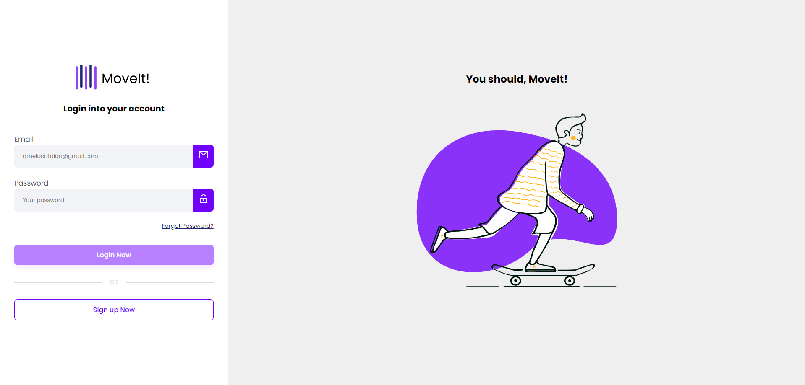

<h1 align="center" style="font-weight: bold;">Login Authentication 💻</h1>

<p align="center">
 <a href="#tech">Technologies</a> • 
 <a href="#started">Getting Started</a> • 
</p>

<p align="center">
    <b>Interface visual onde os usuários inserem seus dados para acessar o sistema ou registrar uma nova conta. Ele inclui formulários para entrada de informações, e validação para garantir a precisão dos dados inseridos, que são enviados para o back-end.</b>
</p>

<h2 id="layout">🎨 Layout</h2>

<p align="center">
    
</p>

<h2 id="technologies">💻 Technologies</h2>

- Angular 17

<h2 id="started">🚀 Getting started</h2>

- Open the project
- Open the terminal
- Start the command "npm run start"

<h3>Prerequisites</h3>

- Angular CLI
- NodeJS
- Git 2

<h3>Cloning</h3>

```bash
git clone [your-project-url-in-github](https://github.com/dudacatalao/login-auth.git)
```

<h3>Starting</h3>

```bash
npm run start
```
